# Diversity Cyber Council Proposal

Presented by

---

## Table of Contents

- [Diversity Cyber Council Proposal](#diversity-cyber-council-proposal)
  - [Table of Contents](#table-of-contents)
  - [1. Overview](#1-overview)
    - [a. About Diversity Cyber Council](#a-about-diversity-cyber-council)
      - [i. Site](#i-site)
      - [ii. Mission](#ii-mission)
    - [b. Vision](#b-vision)
    - [c. Kata Project Goal](#c-kata-project-goal)
  - [2. Kata Program](#2-kata-program)
    - [a. Program Name](#a-program-name)
    - [b. Program Summary](#b-program-summary)
    - [c. Technology Solution Description](#c-technology-solution-description)
  - [3. About the Team](#3-about-the-team)
    - [a. Team Name](#a-team-name)
    - [b. Tagline](#b-tagline)
    - [c. Technology Proposal Summary](#c-technology-proposal-summary)
    - [d. Resources](#d-resources)
  - [4. Captured Requirements](#4-captured-requirements)
    - [a. Users Personas & Cohorts](#a-users-personas--cohorts)
    - [b. Platform Feature Characteristics](#b-platform-feature-characteristics)
    - [c. Hard Platform Requirements](#c-hard-platform-requirements)
  - [5. Architectural Characteristics](#5-architectural-characteristics)
    - [a. Usability](#a-usability)
    - [b. Responsiveness](#b-responsiveness)
    - [c. Feasibility](#c-feasibility)
      - [I. Operational Costs](#i-operational-costs)
      - [II. Infrastructure & Cloud Costs](#ii-infrastructure--cloud-costs)
      - [III. Security Update Costs](#iii-security-update-costs)
    - [d. Elasticity](#d-elasticity)
    - [e. Security](#e-security)
    - [f. Privacy](#f-privacy)
    - [g. Interoperability](#g-interoperability)
    - [h. Data Integrity](#h-data-integrity)
  - [6. Proposed Solution](#6-proposed-solution)
    - [a. Overview & Value Proposition](#a-overview--value-proposition)
    - [b. High-Level Architecture Diagram](#b-high-level-architecture-diagram)
      - [i. HLD Components](#i-hld-components)
      - [ii. Architecture Style](#ii-architecture-style)
      - [iii. C4 Diagrams](#iii-c4-diagrams)
        - [a. System Context Diagram](#a-system-context-diagram)
        - [b. Container Diagram](#b-container-diagram)
      - [iii. Tradeoffs](#iii-tradeoffs)
    - [c. Reporting & Business Intelligence (BI)](#c-reporting--business-intelligence-bi)
    - [d. Deployments](#d-deployments)
    - [e. Sequence Diagram](#e-sequence-diagram)
    - [f. Processes](#f-processes)
    - [g. UI Wireframes](#g-ui-wireframes)
    - [h. Editable/Markdown fields](#h-editablemarkdown-fields)
    - [i. Backlog](#i-backlog)
      - [a. Milestones](#a-milestones)
      - [b. Epics](#b-epics)
      - [c. Defined User Stories & Epics](#c-defined-user-stories--epics)
    - [j. Architectural Decision Records (ADRs)](#j-architectural-decision-records-adrs)
    - [k. Risks and Mitigations](#k-risks-and-mitigations)
  - [7. Definitions / Glossary](#7-definitions--glossary)
    - [501c3 Non-Profit](#501c3-non-profit)
    - [Architecture Decision](#architecture-decision)
    - [Architectural Decision Record](#architectural-decision-record)
    - [AZ - Availability Zone](#az---availability-zone)
    - [Backlog](#backlog)
    - [Doherty Threshold](#doherty-threshold)
    - [Epic](#epic)
    - [High-Level Design](#high-level-design)
    - [Personally Identifiable Information](#personally-identifiable-information)
    - [Total Cost of Ownership](#total-cost-of-ownership)
    - [User Interface](#user-interface)
    - [User Story](#user-story)
    - [3PP](#3pp)
---

## 1. Overview

### a. About Diversity Cyber Council

#### i. Site

[Diversity Cyber Council](https://diversitycybercouncil.com)

#### ii. Mission

Diversity Cyber Council is a 501c3 Non-Profit that serves under-represented demographics in the tech industry by facilitating education, training, and staffing opportunities to establish a sustainable and diverse talent pipeline to the workforce.

### b. Vision

Our vision is to enhance inclusion and representation in the tech industry through training, mentoring, networking, and visibility programs.

### c. Kata Project Goal

Our goal is to establish a sustainable and diverse talent pipeline that extends career equity to underrepresented demographics by providing access to competent training programs that lead to direct employment opportunities.

---

## 2. Kata Program

### a. Program Name

The Spotlight App/Platform

### b. Program Summary

The Spotlight App Project is a sustained effort to amass a coalition of non-profits to address specific needs within the communities we serve by leveraging a centralized platform as the base of operations to collaborate and make a collective impact.

**Problem Statement #1:** The decentralization and lack of support between non-profits create gaps in service and overall impact.

**Problem Statement #2:** The lack of visibility of non-profit groups and offerings creates a barrier to access to the people we aim to serve.

### c. Technology Solution Description

Non-profit Networking Hub & Diverse Candidate Career Case Management Tool

---

## 3. About the Team

The minimal team information is below. Per the proposal's instructions individual team identifying information, including our backstories, has been removed. We hope to communicate this information at an appropriate time. The absolute bare information is available including the team name, tag line, and a summary of our proposal.

### a. Team Name

TheGlobalVariables

### b. Tagline

Illuminate Possibilities

### c. Technology Proposal Summary

A technology solution that serves the purpose of enhancing visibility, support, and collaboration of non-profits serving similar needs in the community and operates as a candidate case management platform.

### d. Resources

| Resource |
|---|
| [Slides](aux-resources/Diversity%20Cyber%20Council%20Proposal%20-%20TheGlobalVariables.pdf) |
| [Video of slides and voice](aux-resources/Spotlight%20App%20-%20TheGlobalVariables.mp4?raw=true) |

---

## 4. Captured Requirements

### a. Users Personas & Cohorts

| Persona | Definition |
|---|---|
| **Non-Profit with offering (“Non-Profit”)** | Group with a platform integration offering |
| **Candidate** | Consumer of non-profit offerings, delivered via the platform |
| **Administrators** | Management of the platform, registering Non-Profits |
| **Community Leader** | Member of the Admin team who consults non-profits to identify their service capabilities, responsibilities, & expectations |
| **Mentor** | Member of Non-Profit, who consults candidates and updates their profile |

### b. Platform Feature Characteristics

- The Platform must establish a way to incentivize engagement such as sharing of resources, collaboration, networking, facilitating introductions, and partnerships
- The Platform must provide a way to allow Non-Profits to publicize offerings to the platform that can provide some level of automatic matching for Candidate requests.
- The Platform allows offerings to contain rich text, links, and downloadable readable content such as PDFs, but no other downloads.
- Each offering must support a certain list of properties (defined by the platform), such as name, organization description, website, unique identifier (assigned by the Administrators) and other identification information.
- The Platform must provide both operational reports (number of candidate matches/period, number of offerings/region, and so on) and analytical reports (projections of future desirable career paths, Offering gaps in a region based on demand, and so on) for use by Administrators.
- The Platform must categorize/tag non-profit support services to match candidate needs that are identified during the onboarding assessment to include (but not limited to):
  - Resume Writing Services
  - Interview Prep
  - Free Business Attire
  - Apprenticeship Program Registration
  - Training Program Registration
  - College & University Registration
  - Free Grocery & Meal Services
  - Discounted Rent & Housing Services
  - Daycare/Child Care Services
  - Mentorship/Career Advocate Services

### c. Hard Platform Requirements

- End-Use Ease of Use is a hard requirement
- Tracking candidate progress is a hard requirement
- Tracking engagement is a hard requirement

---

## 5. Architectural Characteristics

### a. Usability

The end users are not tech-savvy; therefore the success of this product depends on how easy the user can learn new features and how easy it is to use the system on different devices.

### b. Responsiveness

Since the Spotlight App is a user-facing application, it is important to ensure the system responds to end-user requests promptly. All user interactions *MUST* be coded in such a way as to provide some form of feedback for all actions. This feedback must occur within the [Doherty Threshold of 400ms](https://www.uxtoast.com/ux-laws/doherty-threshold).

### c. Feasibility

The cost and time to develop and maintain this application are driving factors. The consumers of this platform are the non-profit organizations for whom, it is important to minimize the operational cost.
The total cost of ownership comprises a significant number of factors. In this particular architecture, excluding new feature development, 3 primary cost factors will make up the majority of the costs.

#### I. Operational Costs

Generally the people costs, by way of employees, consultants, or services firms. The architecture relies heavily on PaaS and SaaS platforms, and the vast majority of components are either self-healing or extremely low maintenance during normal operations periods when not undergoing configuration changes and application upgrades. As such, the number of incidents per month/year would be low, especially as compared to traditional server-based or container-based architectures, which can require a considerable amount of attention simply to keep on top of regular security updates.

With that in mind, the majority of operational costs for upgrades shift from a burden of "updating the OS/servers/platform" to a burden of updating the application's core libraries, which is a cost that is not avoided in traditional architectures, as the vast majority of applications will rely on 3rd party libraries.

However, where incidents do occur requiring data recovery, redeployment, or deeper investigations the skillsets are relatively rare. The technology stack is unique enough that it is not familiar to all architects, even those who operate at the cutting edge within the AWS ecosystem. As such, when events do arise they can be expected to run high, depending on the region the technical resource is located within. A solution architect can run over [$110 USD per hour](https://www.payscale.com/research/CA/Skill=Cloud_Computing/Hourly_Rate), and that can easily double or triple for an emergency call. Incidents may be quick to resolve (1h or less), but can sometimes take a day or more to resolve if it involves data loss.

#### II. Infrastructure & Cloud Costs

Generally, these would include all the infrastructure, cloud, services, licenses, API subscriptions, and other costs associated with running the application frontend and backend, excluding development. In a subsequent phase, an expected high-level budget of operational costs and expected expenses in this category will be performed. The budget will be created utilizing example scenarios, or, more precise numbers if real-world expected user figures are available. A cost breakdown of services would also be an expected deliverable.

As the platform is elastic in both capacity and pricing on every single service it utilizes, there are very few upfront costs, and the costs scale very linearly with users, dependent on user traffic. For simplicity, the types of cohorts and personas are simply referred to as "users".

We've calculated the architectural minimum footprint for a running, but low-utilization (e.g., <10 users) to be under $100 USD per month, excluding operational costs and backup retentions, as the RTO (Recovery time objective) and RPO (Recovery point objective) are not known. We've also made some assumptions, that a standard user session would visit under 20 screens/pages, and that any particular page would, with caching, average 160kb or less.

To that end we've additionally calculated, again making some assumptions around the usage of the data layer on a particular page/screen, and the data storage requirements and access requirements of users on average being 2 sessions per month, that the cost to scale users could be as low as < USD 0.01 per month per user and in some scenarios approach < USD 0.002. The maximum scenario, assuming very rich data, significant data enrichment, plentiful queries, and the assumption that all pages required heavy interaction and that users hit the application numerous times per month did not bring the cost above USD 0.10 per month per user.

Finding the correct costs will depend on collecting additional inputs, including expected user profiles, defining the data models, defining the final interaction processes in the application, and other topical areas that we simply don't have the underlying data to make good assumptions around at this time.

We've deferred the cost breakdown per service instead of the cost per user calculation given the highly variable nature, and low cost per user.

#### III. Security Update Costs

The primary ongoing development costs not related to feature development on this platform, in addition to responding to events and the infrastructure itself, will be the updates to the application libraries to address ongoing security concerns. The application frontend is by far the most vulnerable part of this system in terms of security and will require ongoing updates. Our ultimate conclusion with regards to security costs is that they will not be a burden more than a traditional application. All applications, or any recently built application, rely heavily on 3rd party components. This is true even for traditional server-based monolithic applications. These are costs that a borne regardless of the architecture.

### d. Elasticity

The choice of serverless as a platform allows much faster scaling than if a container or VM-based infrastructure were used. Also, the scaling characteristics of the services are, for the most part, handled by the cloud provider (AWS). Some services have scaling limits (i.e. lambda defaults to 1000 concurrent functions running at a time) and these should be monitored so that the limits can be increased before they become an issue.

A further benefit of the use of a Serverless platform is that idle cost (the cost when there is no load) will be lower than when VMs or containers are used.

### e. Security

The application is exposed on the web which always has the risk of cyberattacks; should the application be accessed by unauthorized users. Moreover, the system stores sensitive information, such as personal data.

### f. Privacy

The system needs to handle the [PII](#personally-identifiable-information) of candidates. Personal information must be accessed by authorized administrators, mentors, and non-profit representatives.

### g. Interoperability

The purpose of this product is to facilitate collaboration between non-profits. To achieve this goal, the Spotlight App needs to communicate with external systems (such as childcare/housing services) and legacy systems.

### h. Data Integrity

The candidate's career path and progress, as well as non-profit information, are accessed by multiple personas. It is crucial to ensure the data is accessed by the authorized person, and the accuracy of the data is maintained throughout its lifecycle.

---

## 6. Proposed Solution

### a. Overview & Value Proposition

The Spotlight App project aims to solve two issues that are faced by any non-profit organization: minimizing the operating cost and increasing the visibility of available services.

Many non-profits choose to minimize their operating costs by cutting the budget of anything other than direct program expenses or to “support the cause”. Most often, this causes non-profits to experience slow growth or an inability to become sustainable due to [a lack of investment in infrastructure and management](https://ssir.org/articles/entry/the_nonprofit_starvation_cycle). In many cases, the non-profit is left with a few volunteers to shoulder much of the work.

On the other hand, the lack of visibility of non-profits and their offerings creates a barrier to access for the people who can benefit most from these programs. The decentralization and lack of support between non-profits create gaps in service and overall impact.

Our proposed solution tackles the lack of visibility by enabling the Spotlight App to be a central hub where non-profits are empowered to identify their service capabilities and publicize their offerings. The Spotlight App also enables the candidates to find services by providing smart recommendations based on the information provided by users and their geographical preferences. Moreover, the notification service enables non-profits to advertise their new offerings to candidates, based on their location/desired services. The Spotlight Mobile App brings the non-profit services closer to the candidates, as [85% of Americans currently own a smartphone](https://www.pewresearch.org/internet/fact-sheet/mobile/). The map view of the non-profit offerings makes it convenient for candidates to locate the services closest to their desired locations (school, home, work). In addition, the prediction capability of our solution helps non-profits identify the offering gaps, and predict the future desirable services. Our solution leverages AWS Pinpoint to collect usage data which essentially provides meaningful metrics to guide administrators and non-profits to improve their offerings and the application usability.

During the design process, we prioritized finding a cost-effective solution, without compromising the efficiency or the usability of the product. Our proposed solution reduces the cost of human resources by automating most of the manual processes that are typically performed by volunteers and employees. This frees them to focus on what is the most important for non-profits (conducting fundraising events, meeting candidates and non-profits). Calendly is used to replace the traditional means of communication (such as phone calls and emails) for scheduling meetings. A recommendation engine is used to simplify the interview process by taking the candidate's profile and needs as inputs and providing smart initial recommendations for a career roadmap.

To reduce the cost of infrastructure, we introduced a Serverless architecture along with an affordable technology stack (such as D3, Vuejs, AWS Amplify). The use of serverless means that the development team does not need to spend time building, securing and maintaining servers. By using D3 and Vuejs for the frontend development, and AWS Amplify for the backend development, the Spotlight App can be developed and deployed faster and within a reasonable budget.

### b. High-Level Architecture Diagram

#### i. HLD Components

For a detailed breakout of components from the HLD, and their handling, see [here](docs/Components.md).

#### ii. Architecture Style

We choose the serverless microservices architectural style to design and run the Spotlight application.

Given the Architectural Characteristics that were identified, as well as the Architecture Styles Worksheet created by [Mark Richards](https://www.developertoarchitect.com/downloads/worksheets.html), we determined that serverless microservices (which is a combination of microservices and event-driven architecture) is the most suitable architectural style.

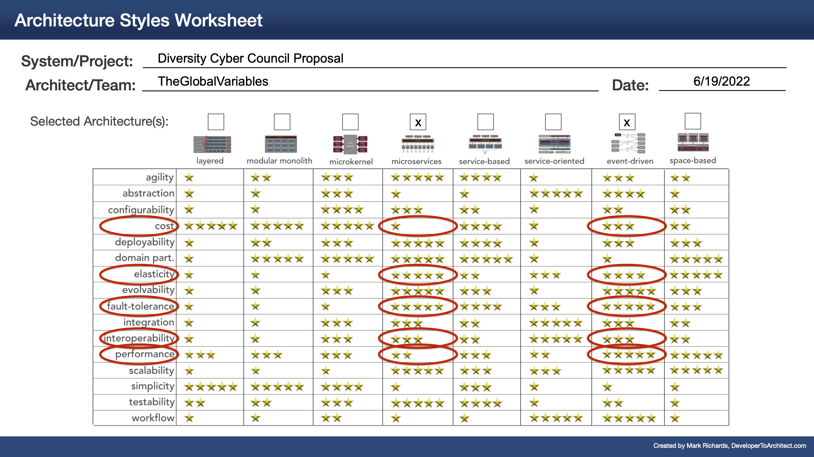

The only downside is cost, which seems to be a drawback with both the microservices and event-driven architectural styles. This, however, is mitigated by the fact that serverless architectures typically involve the use of third-party hosted services, which can reduce operational and infrastructure costs.

#### iii. C4 Diagrams

We leverage the C4 model to describe our proposed software architecture.

##### a. System Context Diagram

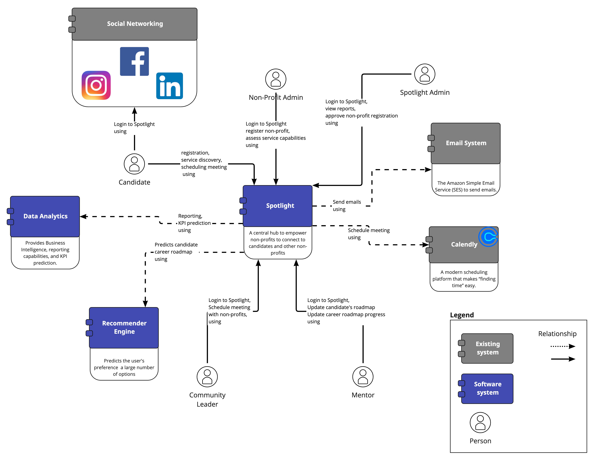

##### b. Container Diagram

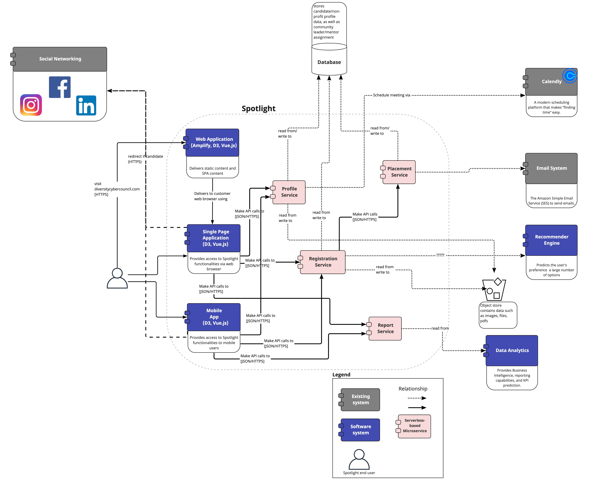

#### iii. Tradeoffs

**Serverless vs Container**
Our solution sacrifices portability/deployability for elasticity/cost. We understand that containers provide greater portability and broad deployability. However, due to budget concerns (in terms of both infrastructure and maintenance), we decided to leverage serverless, even though it introduces the risk of vendor lock-in.

**D3/Vue.js**
On the frontend technology stack, we sacrifice flexibility/productivity for cost/maintainability. React.js provides a lot of flexibility that allows creation of more complex logic and UIs. Vue shines when it comes to small applications: it is easy to use, and Vue templates make everything fast. Since the Spotlight app is fairly simple, and the cost (both development and maintenance) is a driving factor, our natural selection was D3/Vue. Vue also offers options for mobile application development such as [Vue Native](https://vue-native.io/) and [NativeScript](https://nativescript.org/).

**Amplify**
Our solution sacrifices flexibility/portability for simplicity/feasibility. Amplify is a fully-managed cloud service that allows developers to quickly build, deploy and scale web applications. Amplify provides many features out of the box, such as data layer APIs, CI/CD pipelines, Vue/D3 modules for the front-end, among others. Leveraging Amplify, however, introduces the risk of vendor lock-in.

### c. Reporting & Business Intelligence (BI)

We will use AWS Sagemaker to create models, as well as for recommendations and predictions. These will be based on the processes that are currently defined and allow others yet to be defined to be modeled as required.

Initially, these models will be trained with test data, but the models will be retrained as users use the system and refinements will be made based on system usage. This will allow the models to become more accurate as the system is used.

The atomic data sources we intend to use are:

- Amplify analytics
- DynamoDB schemas
- Geolocation data obtained from Amplify
- Other data sources not presently defined or considered

*NOTE:* We will augment user data with geolocation data obtained through Amplify for more geo-specific recommendations.

Interactive reports for the data will be built using Vuejs templates. D3 will be utilized for presenting data visualizations, and in particular to make data-interactive experiences. These may include force-directed graphs to visualize connectivity tissue between parties, geographic heat maps, or the more familiar graph and circle charts.

Simply displaying data isn’t enough. The data needs to be interactive, clickable, and most importantly tell a story. Relevant data should be presented throughout the product's workflows to help visually guide the users, and not simply be a side-reporting engine. This amongst other technical reasons was why we chose d3, over external BI products.

### d. Deployments

Two CI/CD pipelines are proposed to facilitate updates to the infrastructure and applications on the platform:

- AWS Cloudformation will be used to deploy a Route53 zone and subsequent record changes, SageMaker instance, IAM roles and policies, and observability tools. Cloudformation will also bootstrap Amplify.
- AWS Amplify will be used to deploy all the services necessary for the application to run (e.g. Lambda, Cloudfront, Appsync, DynamoDB). It will also handle deployment to services that it depends on, including data models and required accesses.

Updates will be triggered on commit, and the tools will be triggered via webhook.

NOTE: Security scanning could be incorporated in the AWS Amplify build process, to provide a DevSecOps pipline to identify critical and major security risks in the frontend and backend components.

### e. Sequence Diagram

### f. Processes

Below we have provided three Value Stream Mappings (VSM) for the candidate and non-profit registration, as well as the user data purging.

**Candidate Registration**
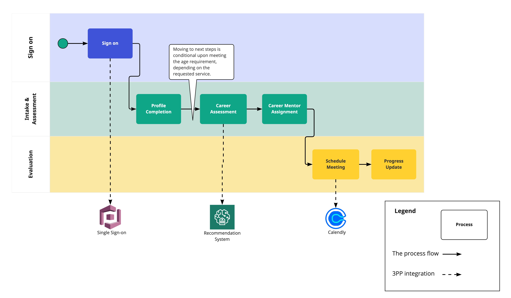

**Non-profit Registration**
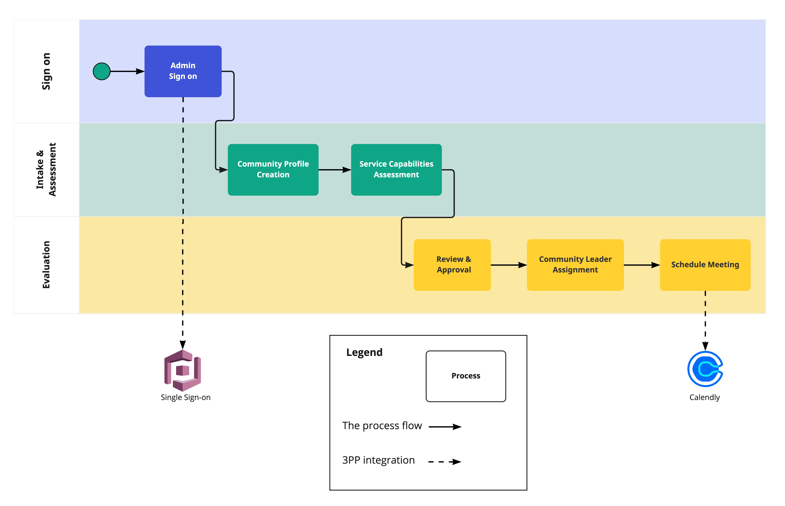

**Purging User data**
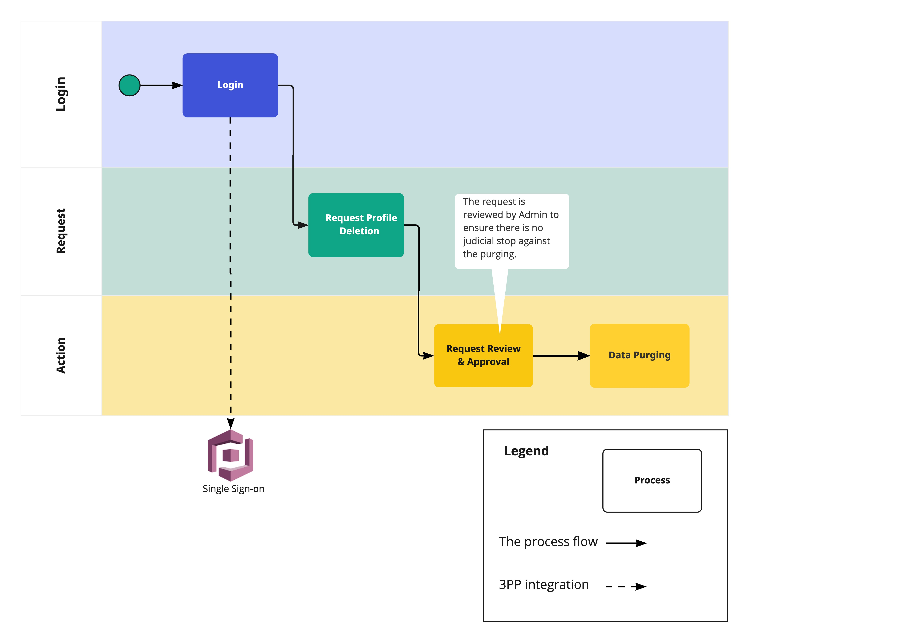

Eventually, in the build-out phase, we will have (potentially) multiple VSMs (one VSM per individual flow). Process descriptions, steps, and individual flow diagrams will be refined significantly with stakeholder feedback.

### g. UI Wireframes

User interface wireframes will be expanded should this proposal be selected for the finals, and refined iteratively with stakeholder feedback as required.

  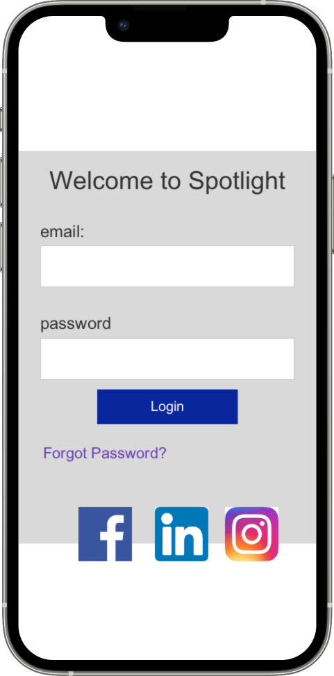
  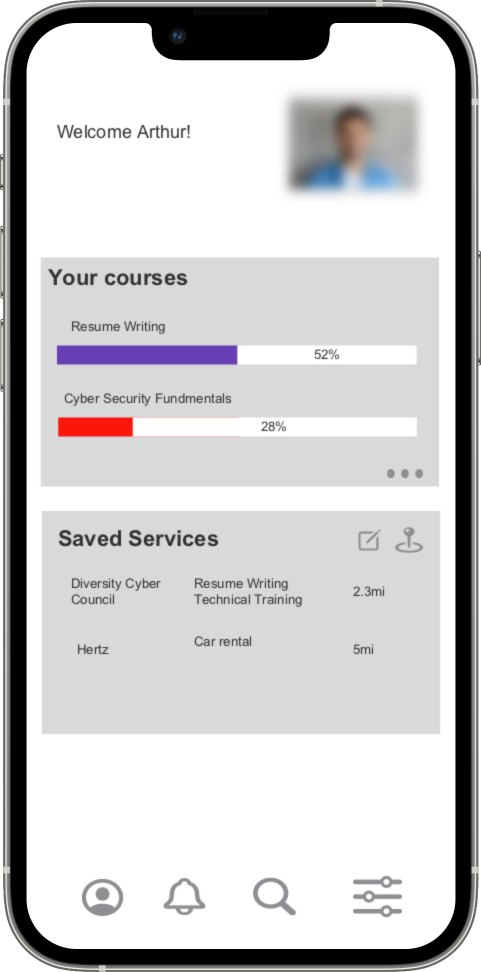 
  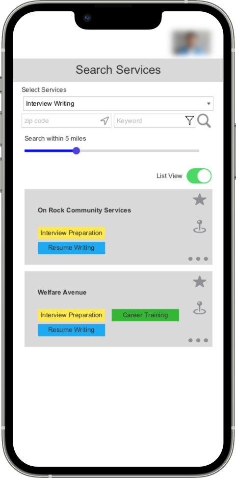
  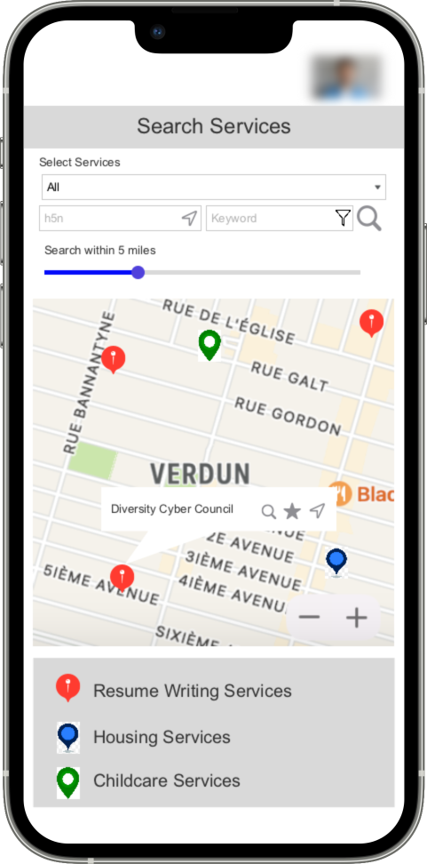
  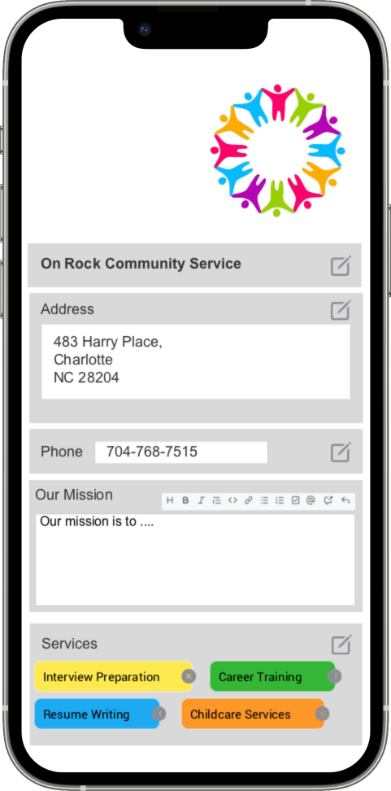
  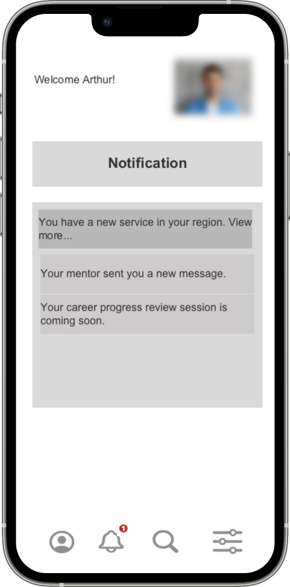

### h. Editable/Markdown fields

Editable fields will allow for a reduced subset of markdown text (see UI wireframes 'non-profit edit profile'). In particular 'edit' fields will each come with the ability to edit markdown fields, with optional hints and editor functions, and markdown will be used in the presentation layer to present markdown-enabled fields. In the case of a field that is not markdown-friendly, we will restrict the markdown ability appropriately by not making the editor available, and to ensure no confusion, filter and present a textual warning on the UI in case someone tries to directly edit a field in markdown which does not support it. The precise nature of which fields will support markdown is an implementation phase concern and will be addressed at that time on a case-by-case basis taking into account business process requirements. As such when the schema and data fields are created, we'll work with the stakeholders to define which fields require rich editing capabilities and utilize visual markdown editors and viewers as much as possible and where appropriate.

### i. Backlog

The creation and refinement of a Backlog of tasks to be performed is a key step and needs to be performed very early on should this proposal be selected. Milestones are a "living document" throughout the project. These Milestones and Epics shown here act provide a starting point for likely major product architectural milestones.
      
#### a. Milestones

The initial set of milestones are placeholders, and actual user feedback and soliciting feedback from every milestone and partial milestone will modify this list, the description, and the priority.

| Milestone | Description |
|---|---|
| Architectural | Complete architectural planning, business requirements and signoff |
| Platform | Automate and deploy the initial platform |
| Application development | MVP of the application (signups, initial schema, vue libraries, etc) |
| Application development rich editing | Comprehensive editing capabilities and all fields |
| Application connectivity | Learning, connecting users and organizations |
| Reporting and data richness | Reports, data overlays, and interactive and data driven pages |

#### b. Epics

The initial set of epics only broadly cover some of the high level aspects around the architecture. Not captured here are numerous epics related to the application implementation beyond the archicture, nor the operational aspects of keeping the app running.

| Epic | Description |
|---|---|
| Amplify frontend | Create automation and deploy initial amplify frontend project(s) for at least production & staging |
| Amplify backend | Create automation and deploy initial amplify backend project, connect to frontends |
| Data models | Map out schema for initial dynamodb models including fields, S3 storage, graphql statements |
| Identify providers | Implement 3rd party identity providers with Cognito |
| Vue processes | Implement the application workflows and processes within the vue framework provided with graphql and s3 data interfaces |
| Credential helpers | Implement credential storage and helpers, including lambdas to maintain resets/syncs |
| Data model permissions | Overlay permissioning models for application admins, users, and organizations |
| Compliance reporting | Work with legal to define and implement appropriate initial required compliance reports |
| ML, data enhancement | Make use of sagemaker and other data enhancers to backfeed in connectivity between data nodes, estimates, and predictions |
| Observability | Deploy X-ray, alerting/alarming on cloudwatch metrics |
| Backups | Implement basic non-airgap data layers backups (dynamodb, cognito, etc) |

#### c. Defined User Stories & Epics

This task has been deferred to post finalist selection, given the varied nature and significant number of details that may be required collaboratively with the interested parties in making the majority of these decissions. We would recommend a "sprint 0" backlog refining review to go over the implication of all design decisions before extensive planning takes place on any particular epic, especially before they are broken down into user stories and functional requirements.

### j. Architectural Decision Records (ADRs)

| ADR Link | Topic |
|---|---|
| [ADR 0001](ADR/ADR%200001-Choice%20of%20Serverless.md) | Choice of Serverless |
| [ADR 0002](ADR/ADR%200002-Choice%20of%20Cloud%20Provider.md) | Choice of Cloud Provider |
| [ADR 0003](ADR/ADR%200003-Process%20Modeling.md) | Process Modeling |
| [ADR 0004](ADR/ADR%200004-Observability.md) | Observability |
| [ADR 0005](ADR/ADR%200005-Amplify.md) | Amplify |
| [ADR 0006](ADR/ADR%200006-Markdown.mdd) | Markdown |

### k. Risks and Mitigations

1. Vendor Lock-in: leveraging AWS Amplify and Serverless introduces the risk of vendor lock-in. We believe the benefits outweigh the risks, as both services significantly reduce the operation cost, and free the development team from setting up the infrastructure and the DevOps toolkit.
  - To mitigate the risk of lock-in, we recommend identifying which amplify-specific modules are in use, in case a future migration is required
  - In particular, the Cognito backend deployed by Amplify will require significant efforts to migrate local users and permissions. This is a problem that is particular to all major identity and authentication systems.

2. Third-Party Library Updates: Amplify and frontend libraries require frequent security updates to mitigate the exploitation of security vulnerabilities. 
  - There is no need to mitigate this risk. The velocity increase from utilizing these pre-made or partially made components to accelerate development are deferred to a later date if migration is required.

3. Staff Training and Industry Knowledge
  - Mitigations: creating a well-designed website/app is crucial to ensure users (including staff) can quickly learn how to use it. The Vendor shall provide a video demo on how to use the tool, in the case of major UI/workflow changes.

---

## 7. Definitions / Glossary

### 501c3 Non-Profit

A non-profit corporation or trust that is tax-exempt. See [Wikipedia](https://en.wikipedia.org/wiki/501(c)(3)_organization)

### Architecture Decision

A design choice with larger significance.

### Architectural Decision Record

A document that captures an important architecture decision along with the context and consequences.

### AZ - Availability Zone

A cloud provider's data center housed in a physically separated location. Deploying to multiple availability zones means that an application can survive the loss of a given data center. Multiple availability zones make up a region.

### Backlog

A 'to-do' list of features or tasks to be performed to complete work.

### Doherty Threshold

An objective for keeping a user engaged while interacting with a software system. If the system does not respond within ~400ms the user may become disinterested.

### Epic

A high-level task that can be broken down into smaller tasks that are to be added to a backlog.

### High-Level Design

A general system design that provides an overview of the entire system.

### Personally Identifiable Information

Data that when used alone or in conjunction with other information can identify an individual.

### Total Cost of Ownership

The complete calculation of costs of a software property. In software, this refers to not only the runtime cost but also the cost of operation.

### User Interface

Any means that a user may use to interact with a system.

### User Story

An explanation of a software feature written from the perspective of a user persona.

### 3PP

A Third-Party Product(3PP) is a reusable software component developed to be either freely distributed or sold by an entity other than the original vendor of the development platform.
