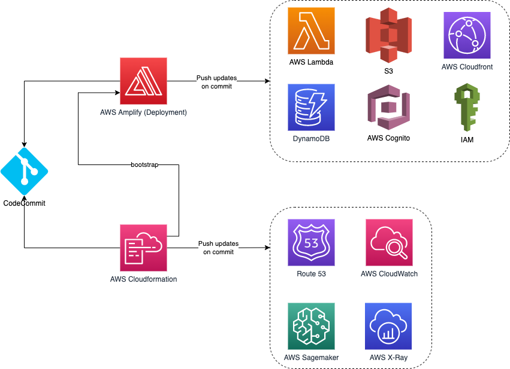

# Diversity Cyber Council Proposal

Presented by


## Table of Contents

```diff
1. Overview
  a. About Diversity Cyber Council
    i. Site
    ii. Mission
  b. Vision
  c. Kata Project Goal
2. Kata Program
  a. Program Name
  b. Program Summary
  c. Technology Solution Description
3. About Team
  a. Team Name
  b. Tagline
  c. Technology Proposal Summary
4. Captured Requirements
  a. Users Personas & Cohorts
  b. Platform Feature Characteristics
  c. Hard Platform Requirements
5. Architectural Characteristics
  a. Usability
  b. Security
  c. Privacy
  d. Interoperability
  e. Feasibility
  f. Data Integrity
  g. Responsiveness
  h. Availability
  i. Performance Characteristics
  j. Scalability
  k. Total Cost of Ownership
    i. Operational Costs
    ii. Infrastructure & Cloud Costs
    iii. Security Update Costs
6. Proposed Solution
  a. Overview & Value Proposition
  b. High Level Archecture Diagram
    i. HLD Components
  c. Reporting & Business Intelligence (BI)
  d. Deployments
  e. User Interactions
  f. Sequence Diagram
    i. Processes
    ii. UI Wireframes
    iii. Editable/Markdown fields
  g. Backlog
    i. Epics & Milestones
    ii. Defined User Stories & Epics
  h. Architectural Decision Records (ADRs)
7. Definitions / Glossary
```

## 1. Overview

### a. About Diversity Cyber Council

#### i. Site

[Diversity Cyber Council](https://diversitycybercouncil.com)

#### ii. Mission

Diversity Cyber Council is a 501c3 Non-Profit that serves under-represented demographics in the tech industry by facilitating education, training, and staffing opportunities to establish a sustainable and diverse talent pipeline to the workforce.

### b. Vision

Our vision is to enhance inclusion and representation in the tech industry through training, mentoring, networking, and visibility programs.

### c. Kata Project Goal

Our goal is to establish a sustainable and diverse talent pipeline that extends career equity to underrepresented demographics by providing access to competent training programs that lead to direct employment opportunities.

## 2. Kata Program

### a. Program Name

Spotlight App/Platform

### b. Program Summary

The Spotlight App Project is a sustained effort to amass a coalition of nonprofits in order to address specific needs within the communities we serve by leveraging a centralized platform as the base of operations to collaborate and make a collective impact.

**Problem Statement #1:** The decentralization and lack of support between nonprofits create gaps of service and overall impact.

**Problem Statement #2:** The lack of visibility of nonprofit groups and offerings creates a barrier of access to the people we aim to serve.

### c. Technology Solution Description

Nonprofit Networking Hub & Diverse Candidate Career Case Management Tool

## 3. About Team

The minimal team information is below. Per the proposals instructions individual team identifying information, including our backstories, has been removed. We hope to communicate this information at an appropriate time. FOr now the absolute bare information is available including the team name, tag line, and a summary of our proposal.

### a. Team Name

TheGlobalVariables

### b. Tagline

Illuminate Possibilities

### c. Technology Proposal Summary

A technology solution that serves the purpose of enhancing visibility, support, and collaboration of nonprofits serving similar needs in the community and operate as a candidate case management platform.

## 4. Captured Requirements

### a. Users Personas & Cohorts

| Persona | Definition |
|---|---|
| **Non-Profit with offering (“Non-Profit”)** | Group with a platform integration offering |
| **Candidate** | Consumer of non-profit offerings, delivered via the platform |
| **Administrators** | Management of the platform, registering Non-Profits |

```diff
- Samira to update
```

### b. Platform Feature Characteristics

- The Platform must establish a way to incentivize engagement such as sharing of resources, collaboration, networking, facilitating introductions, and partnerships
- The Platform must provide a way to allow Non-Profits to publicize offerings to the platform that can provide some level of automatic matching for Candidate requests.
- The Platform allows offerings to contain rich text, links, and downloadable readable content such as PDFs, but no other downloads.
- Each offering must support a certain list of properties (defined by the platform), such as name, organization description, website, unique identifier (assigned by the Administrators) and other identification information.
- The Platform must provide both operational reports (number of candidate matches / period, number of offerings / region, and so on) and analytical reports (projections of future desirable career paths, Offering gaps in a region based on demand, and so on) for use by Administrators.
- The Platform must categorize/tag nonprofit support services to match candidate needs that are identified during the onboarding assessment to include (but not limited to):
  - Resume Writing Services
  - Interview Prep
  - Free Business Attire
  - Apprenticeship Program Registration
  - Training Program Registration
  - College & University Registration
  - Free Grocery & Meal Services
  - Discounted Rent & Housing Services
  - Daycare/Child Care Services
  - Mentorship/Career Advocate Services

### c. Hard Platform Requirements

- End-Use Ease of Use is a hard requirement
- Tracking candidate progress is a hard requirement
- Tracking engagement is a hard requirement

## 5. Architectural Characteristics

### a. Usability

The end users are not tech-savvy; therefore the success of this product depends on how easy the user can learn new features and how easy it is to use the system on different devices.

### b. Security

The application is exposed on the web which always has the risk of cyberattacks, if the application accessed by unauthorized users. Moreover, the system stores sensitive information, such as personal data.

### c. Privacy

The system needs to handle the PII of candidates. Personal information must be accessed by the authorized administrators, mentors, and non-profit representatives.

### d. Interoperability

The purpose of this product is to facilitate the collaboration between non-profits. To achieve this goal, Spotlight needs to communicate with other external systems (such as childcare/housing services) and other legacy systems.

### e. Feasibility

The cost and time to develop and maintain this application is a driving factor. The consumers of this platform are the non-profit organizations for whom, it is important to minimize the operational cost.

### f. Data Integrity

The candidate's career path and progress, as well as non-profit information are accessed by multiple personas. It is crucial to ensure the data is accessed by the authorized person, and the accuracy of the data is maintained throughout its lifecycle.

### g. Responsiveness

Since Spotlight is user-facing, it is important to ensure the system responds to the end user requests in a timely manner.

### h. Availability

Amazon provides services in multiple Availability Zones. By using Serverless services, the Diversity Cyber Council platform will make use of these, by default and as such, the platform can withstand the loss of a given Availability Zone.

### i. Performance Characteristics

All user interactions *MUST* be coded in such a way as to provide some form of feedback for all actions. This feedback must occur within the Doherty Threshold of 400ms.

### j. Scalability

The choice of serverless as a platform allows much faster scaling than if container or VM based infrastructure were used. Also, the scaling characteristics of the services are, for the most part, handled by the cloud provider (AWS). There are some services that have scaling limits (i.e. lambda defaults to 1000 concurrent functions running at a time) and these should be monitored so that the limits can be increased before they become an issue.

A further benefit of the use of a Serverless platform is that idle cost (the cost when there is no load) will be lower than when VMs or containers are used.

### k. Total Cost of Ownership

The total cost of ownership comprises a significant numer of factors. In this particular architecture, with exception to new feature development, 3 primary cost factors will make up the majority of the costs.

#### i. Operational Costs

Generally the people costs, by way of employees, consultants, or services firms. The subsequent phase, if applicable and if chosen for the semifinals, will provide an expected high level budget of operational costs and expected expenses in this category.

#### ii. Infrastructure & Cloud Costs

Generally these would include all the infrastructure, cloud, services, licenses, API subscriptions, and other costs associated with running the application frontend and backend, excluding development. The subsequent phase, if applicable and if chosen for the semifinals, will provide an expected high level budget of operational costs and expected expenses in this category. The budget will be created utilizing example scenarios, or, more precise numbers if real world expected user figures are availalbe. A cost breakdown of services will be provided.

#### iii. Security Update Costs

The primary ongoing development cost not related to feature development on this platform, in addition to responding to events and the infrastructure its self, will be the updates to the application libraries to address ongoing security concerns. The application frontend is by far the most vulnerable part of this system in terms of security, and will require ongoing updates. The subsequent phase, if applicable and if chosen for the semifinals, will provide an expected high level budget of operational costs and expected expenses in this category.

## 6. Proposed Solution

### a. Overview & Value Proposition

```diff
- Samira to update
```

### b. High Level Archecture Diagram


#### i. HLD Components

For a detailed breakout of components from the HLD, and their handling, see [here](docs/Components.md)

### c. Reporting & Business Intelligence (BI)

```diff
- Scott
```

### d. Deployments



Two CI/CD pipelines are proposed to facilitate updates to the infrastructure and applications on the platform:

- AWS Cloudformation will be used to deploy a Route53 zone and subsequent record changes, SageMaker instance, IAM roles and policies, and observability tools. Cloudformation will also bootstrap Amplify.
- AWS Amplify will be used to deploy all the services necessary for the application to run (e.g. Lambda, Cloudfront, Appsync, DynamoDB). It was also handle deployment to services that it depends on, including data models and required accesses.

Updates will be triggered on commit, and the tools will be triggered via webhook.

### e. User Interactions

User interactions will be expanded at if this proposal endures its self into the semifinals, and afterwards refined significantly with stakeholder feedback rounds as required if selected past the semi-finals/finals. In particular the user interactions will rely on the processes defined.

### f. Sequence Diagram


#### i. Processes

Process descriptions, steps, and individual flow diagrams (as required) will be expanded at if this proposal endures its self into the semifinals, and afterwards refined significantly with stakeholder feedback rounds as required if selected past the semi-finals/finals.

#### ii. UI Wireframes

User interface wireframes will be expanded at if this proposal endures its self into the semifinals, and afterwards refined significantly with stakeholder feedback rounds as required if selected past the semi-finals/finals.

#### iii. Editable/Markdown fields

Editable/Markdown fields will be expanded at if this proposal endures its self past the semi-finals/finals. When the schema and data fields are created, we'll work with the stakeholders to define which fields require rich editing capabilities, and utilize visual markdown editors and viewers as much as possbile and where appropriate.

### g. Backlog

The Backlog refinement and entries will begin if this proposal endures its self into the semifinals, with refinement at each stage into the and past the finals.

#### i. Epics & Milestones

To be defined if a semifinalist, if appropriate.

#### ii. Defined User Stories & Epics

Epics with some known stories to be flushed out in the semifinalist stage, with additional refinement post-finalist, if appropriate, and then on a milestone start and sprint start basis, milestone by milestone and sprint by sprint.

### h. Architectural Decision Records (ADRs)

| ADR Link | Topic |
|---|---|
| [ADR 0001](ADR/ADR%200001-Choice%20of%20Serverless.md) | Choice of Serverless |
| [ADR 0002](ADR/ADR%200002-Choice%20of%20Cloud%20Provider.md) | Choice of Cloud Provider |
| [ADR 0003](ADR/ADR%200003-Process%20Modeling.md) | Process Modeling |
| [ADR 0004](ADR/ADR%200004-Observability.md) | Observability |
| [ADR 0005](ADR/ADR%200005-Amplify.md) | Amplify |

## 7. Definitions / Glossary

### 501c3 Non-Profit

A non-profit corporation or trust that is tax-exempt. See [wikipedia](https://en.wikipedia.org/wiki/501(c)(3)_organization)

### Architecture Decision

A design choice with larger significance.

### Architectural Decision Record

A document that captures an important architecture decision along with the context and consequences.

### AZ - Availability Zone

A cloud providers data center that is in a physically separated location. Deploying to multiple availability zones means that an application can survive the loss of a given data center. Multiple availability zones make up a region.

### Backlog

A 'to-do' list of features or tasks to be performed to complete work.

### Doherty Threshold

An objective for keeping a user engaged while interacting with a software system. If the system does not respond within ~400ms the user may become disinterested.

### Epic

A high-level task that can be broken down into smaller tasks that are to be added to a backlog.

### High-Level Design

A general system design that provides an overview of the entire system.

### Personally Identifiable Information

Data that when used alone or in conjunction with other information can identify an individual.

### Total Cost of Ownership

The complete calculation of costs pertaining to a software property. In software, this refers to not only the runtime cost but also the cost of operation.

### User Interface

Any means that a user may use to interact with a system.

### User Story

An explanation of a software feature written from the perspective of a user persona.
