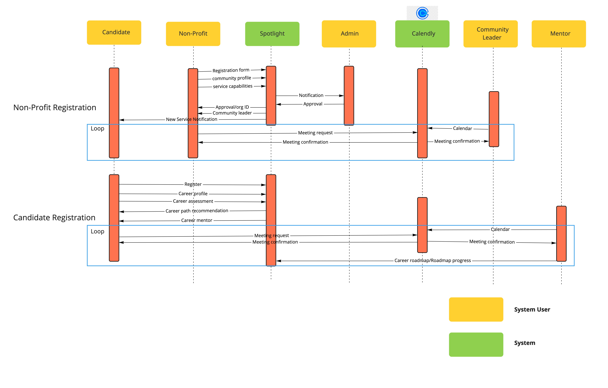

# Diversity Cyber Council Proposal
Presented by 

## Table of Contents
```
TOC fixme
Number AFTER we finish editing
1.
  a.
    i.
    ...
```


## Overview

### About Diversity Cyber Council
#### Site
https://diversitycybercouncil.com/ (fixme link)

#### Mission
Diversity Cyber Council is a 501c3 Non-Profit that serves under-represented demographics in the tech industry by facilitating education, training, and staffing opportunities to establish a sustainable and diverse talent pipeline to the workforce.

### Vision
Our vision is to enhance inclusion and representation in the tech industry through training, mentoring, networking, and visibility programs.

### Kata Project Goal
Our goal is to establish a sustainable and diverse talent pipeline that extends career equity to underrepresented demographics by providing access to competent training programs that lead to direct employment opportunities. 

## Kata Program

### Program Name
Spotlight App/Platform

### Program Summary
The Spotlight App Project is a sustained effort to amass a coalition of nonprofits in order to address specific needs within the communities we serve by leveraging a centralized platform as the base of operations to collaborate and make a collective impact. 												
Problem Statement #1: The decentralization and lack of support between nonprofits create gaps of service and overall impact. 												
Problem Statement #2: The lack of visibility of nonprofit groups and offerings creates a barrier of access to the people we aim to serve.

### Technology Solution Description
Nonprofit Networking Hub & Diverse Candidate Career Case Management Tool 	

## About Team

### Team Name
TheGlobalVariables

### Tagline
Illuminate Possibilities

### Technology Proposal Summary
A technology solution that serves the purpose of enhancing visibility, support, and collaboration of nonprofits serving similar needs in the community and operate as a candidate case management platform.

### Team Members
fixme

## Captured Requirements
### Users Personas & Cohorts
 -	Non-Profit with offering (“Non-Profit”) - group with a platform integration offering
 -	Candidate - consumer of non-profit offerings, delivered via the platform
 -	Administrators - Management of the platform, registering Non-Profits

### Platform Feature Characteristics
 - The Platform must establish a way to incentivize engagement such as sharing of resources, collaboration, networking, facilitating introductions, and partnerships
 - The Platform must categorize/tag nonprofit support services to match candidate needs identified in the onboarding assessment to include but not limited to
 - The Platform must provide a way to allow Non-Profits to publicize offerings to the platform that can provide some level of automatic matching for Candidate requests.
 - The Platform allows offerings to contain rich text, links, and downloadable readable content such as PDFs, but no other downloads.
 - Each offering must support a certain list of properties (defined by the platform), such as name, organization description, website, unique identifier (assigned by the Administrators) and other identification information.
 - The Platform must provide both operational reports (number of candidate matches / period, number of offerings / region, and so on) and analytical reports (projections of future desirable career paths, Offering gaps in a region based on demand, and so on) for use by Administrators.
 - Resume Writing Services	
   - Interview Prep	
   - Free Business Attire
   - Apprenticeship Program Registration	
   - Training Program Registration 	
   - College & University Registration 
   - Free Grocery & Meal Services	
   - Discounted Rent & Housing Services	
   - Daycare/Child Care Services
   - Mentorship/Career Advocate Services	

### Hard Platform Requirements
 - End-Use Ease of Use is a hard requirement
 - Tracking candidate progress is a hard requirement
 - Tracking engagement is a hard requirement

## Presumed Requirements
### Operability
### Supportability
### Availabilty of Resources
### Future-proofing
### Total Cost of Ownership
#### Operational Costs
#### Infrastructure & Cloud Costs
#### Security Update Costs
### Future High Availability
### Future Scalability
### Security
### Performance characteristics
### User Platform Support
## Proposed Solution
### Overview & Value Proposition
### High Level Archecture Diagram

fixme do a final export of this Friday, still misc changes/cleanup

#### HLD Components
For a detailed breakout of components from the HLD, and their handling, see [here](docs/Components.md)

### Sequence Diagram


### UI Wireframes
  TODO

### Deployments
  TODO statement on handling amplify/CICD process here

### User interactions (processes)
  TODO list

### Backlog
#### Epics & Milestones
#### Defined User Stories & Epics

### Active Design Reviews (ADRs)

#### ADR 0001 - Choice of Serverless
[ADR 0001](ADR/ADR%200001-Choice%20of%20Serverless.md)

#### ADR 0002 - Choice of Cloud Provider
[ADR 0002](ADR/ADR%200002-Choice%20of%20Cloud%20Provider.md)

#### ADR 0003 - Process Modeling
[ADR 0003](ADR/ADR%200003-Process%20Modeling.md)

#### ADR 0004 - Observability
[ADR 0004](ADR/ADR%200004-Observability.md)

## Definitions


												
											
 												


## TODO (placement)
```
Networking Hub Functionality & Process

Operational Process - Registration & Intake (Non-Profit)						
Step 1	New Non-Profit registers on platform 					
Step 2	New Non-Profit completes community profile 					
Step 3	New Non-Profit completes service capabilities assessment					
Step 4	Completion of profile and assessment automatically starts intake				
Step 5	New Non-Profit assignment created					
Operational Process - Mentor Assignment & Roadmap						
Step 6	New Non-Profit assigned a community leader					
Step 7	Email sent to new Non-Profit introducing community leader					
Step 8	Introductory meeting is schedule within 1-2 weeks to discuss non profit service capabilities, responsibilities, & expectations					
Step 9	Regular cadence touchpoints scheduled between new non-profit and community leader	
Step 10 Platform Role based training is assigned to new Non-Profit				
Step 11 New Non-Profit is invited to monthly community meetings				

Career Case Management Functionality & Process

Operational Process - Registration & Intake & Career Assessment	
Step 1	Candidate registers on platform	
Step 2	Candidate completes a career profile	
Step 3	Candidate completes a career assessment	
Step 4	Completion of profile and assessment automatically starts intake	
Step 5	New candidate assignment created	

Operational Process - Mentor Assignment & Roadmap		
Step 6	New candidate assigned a career mentor	
Step 7	Email sent to new candidate introducing career mentor	
Step 8	Introductory meeting is schedule within 1-2 weeks to discuss candidate needs and develop career roadmap	
Step 9	Regular cadence touchpoints scheduled between new candidate and career mentor 	
Step 10	Career mentor uploads new candidate career roadmap in platform	
Step 11	Career mentor updates candidate assignment in platform to reflect career roadmap	

Operational Process - Candidate Services		
Resume Writing Services	
Interview Prep	Free Business Attire
Apprenticeship Program Registration	
Training Program Registration 	
College & University Registration 
Free Grocery & Meal Services	
Discounted Rent & Housing Services	
Daycare/Child Care Services
Mentorship/Career Advocate Services		

Technical Details
Domain areas:
Non-Profit Community 
NonProfit Profiles
Open Community - No Connection Requests
Due to the open community please ensure volume of posts will not cause missing important content, maybe a separate forum for posts the nonprofit opts into?
Engagement Enhancers - how can engagement be enhanced based on app/platform design and functionality? Weekly NonProfit Spotlights for Engagement? How else to incentivize? 


Candidate Onboarding Community
Registration 
Needs Assessment
Career Roadmap
Candidate / Non-Profit Matching 
What is the most efficient and effective process to meet the need?
How will candidate progress be tracked
How will nonprofit gain value?
Integration (extranet)
```
